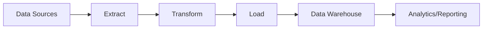

# 🚀 Data Engineering Project

Welcome to the **Data Engineering Project**!  
This project focuses on building a robust and scalable data pipeline that extracts, transforms, and loads (ETL) data from multiple sources into a centralized data warehouse for analytics and reporting.

---

## 📚 Table of Contents
- [Project Overview](#project-overview)
- [Architecture](#architecture)
- [Tech Stack](#tech-stack)
- [Folder Structure](#folder-structure)
- [Installation](#installation)
- [Usage](#usage)
- [Contributing](#contributing)
- [License](#license)

---

## 📖 Project Overview

This project aims to:
- Collect data from APIs, databases, and flat files.
- Perform necessary transformations and cleaning.
- Load the processed data into a data warehouse like **Amazon Redshift**, **Google BigQuery**, or **Snowflake**.
- Schedule workflows using **Apache Airflow**.
- Monitor pipeline performance and data quality.

---

## 🏗️ Architecture



- **Extract**: API, CSV, JSON, Databases
- **Transform**: Data cleaning, formatting, aggregation
- **Load**: Insert/Upsert into Data Warehouse
- **Tools**: Airflow, Spark, dbt, Python scripts

---

## 🛠️ Tech Stack

| Technology  | Purpose             |
|-------------|---------------------|
| Python      | Core ETL scripts     |
| Apache Airflow | Orchestration     |
| AWS S3 / GCP Storage | Data Storage |
| AWS Redshift / BigQuery | Data Warehouse |
| dbt         | Data transformation and modeling |
| Docker      | Containerization     |
| GitHub Actions | CI/CD for pipelines |

---

## 📁 Folder Structure

```bash
data-engineering-project/
│
├── dags/             # Airflow DAGs
├── etl/              # ETL Scripts
├── config/           # Configuration files
├── tests/            # Unit and integration tests
├── docs/             # Documentation
├── Dockerfile        # Docker configuration
├── requirements.txt  # Python dependencies
└── README.md         # Project overview
```

---

## ⚙️ Installation

1. Clone the repository:

```bash
git clone https://github.com/your-username/data-engineering-project.git
cd data-engineering-project
```

2. Set up a virtual environment and install dependencies:

```bash
python -m venv venv
source venv/bin/activate   # For Windows: venv\Scripts\activate
pip install -r requirements.txt
```

3. Configure your environment variables in `.env` or the `config/` directory.

4. (Optional) Start with Docker:

```bash
docker-compose up --build
```

---

## 🚀 Usage

- To run the ETL job manually:

```bash
python etl/main.py
```

- To run through Airflow:
    - Start Airflow webserver and scheduler
    - Access the DAGs UI and trigger the workflow

